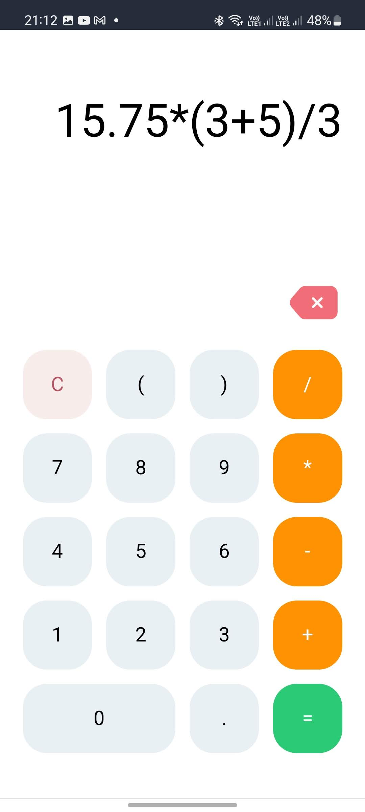

<h1 style="text-align: center;">Calculatron</h1>

Para realizar o desafio proposto de criar uma calculadora com React, eu fiz uso do TypeScript e do SCSS, para assim criar um sistema mobile-first e responsivo que consegue fazer calculos de expressões matemáticas encadeadas. O sistema conta com todo os dígitos numéricos (0-9), operações básicas (soma, subtração, multiplicação e divisão), ponto, parênteses e funções de limpar, apagar e executar operação.

Para executar as operações, eu fiz uso da função nativa eval(), de tal forma que qualquer operação matemática válida pode ser executada através da interface da calculadora. Contudo, foram implementados diversos sistemas de controle de exceção para evitar quebra no sistema ao processar operações indevidas. Infelizmente não consegui cobrir todos os erros, então ainda é possível encontrar alguns bugs em casos específicos de uso.

---
## Tratamentos

Considerando os riscos atrlados ao uso do eval(), resolvi não usar um input para a exibição das operações e resultados. Além disso, como não há comunicação com um sistema back-end, também não há risco de injeção de dados indevidos.

Além disso, busquei mitigar problemas com o uso de parênteses vazios, execução de um operador, campo vazio, operador no começo ou no final da operação, parênteses sem fechamento e a combinação de operadores.

---
## Próximos passos

Apesar da quantidade de tratamentos já realizados, ainda faltam muitos outros, como por exemplo: inserir o operador de multiplicação em operações como x(y), uso indevido do ponto, tratar parênteses inseridos em ordem indevida ")(" entre outros casos.

Ainda, pretende-se desenvolver novas ferramentas para melhorar a experiência de uso, como o reconhecimento de entradas com o teclado, separação entre campo de operação e campo de resultado no display e ajuste dinâmico do tamanho da fonte no display em caso de muitos caracteres.

---

## Links

**Código fonte**: https://github.com/Palhanor/Calculatron

**Projeto funcional**: https://palhanor.github.io/Calculatron/

